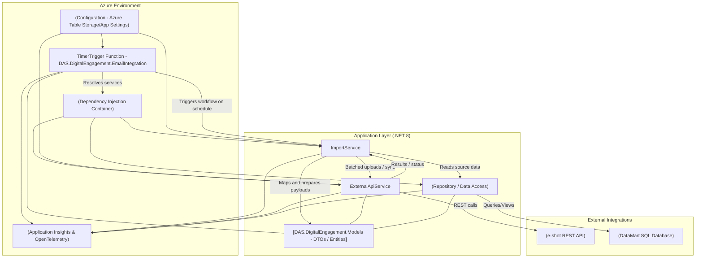

# DAS.DigitalEngagement.EmailIntegration

## Overview

This repository contains projects targeting .NET 8 for digital engagement and email integration. The solution is designed to facilitate seamless email communication and integration within digital engagement platforms.

---

## Solution Projects Overview

### 1. DAS.DigitalEngagement.EmailIntegration

- **Type:** Azure Functions (.NET 8)
- **Purpose:**  
  Provides the core functionality for integrating email services into digital engagement workflows. It acts as the entry point for email-related operations, such as sending and receiving emails, and integrates with external email providers.
- **Key Features:**
  - Email sending and receiving via Azure Functions.
  - Integration with external email providers.
  - Logging and monitoring of email activity using Application Insights and OpenTelemetry.
- **Implementation Details:**
  - Uses Azure Functions Worker SDK for scalable, event-driven execution.
  - Configuration and service registration are handled via extension methods for maintainability.
  - Relies on dependency injection to manage services and external API integrations.
  - References the `DAS.DigitalEngagement.Application` and `DAS.DigitalEngagement.Models` projects for business logic and data models.

---

### 2. DAS.DigitalEngagement.Application

- **Type:** Class Library (.NET 8)
- **Purpose:**  
  Contains the business logic and service implementations required for digital engagement, including email integration workflows.
- **Key Features:**
  - Services for interacting with external APIs and data sources.
  - Handlers for processing import and integration tasks.
  - Repository pattern for data access and abstraction.
- **Implementation Details:**
  - Uses dependency injection for service management.
  - Implements services such as `ExternalApiService` and `ImportService` to encapsulate integration logic.
  - Utilizes `CsvHelper` for data import/export and `Microsoft.Data.SqlClient` for database access.
  - All models are referenced from the `DAS.DigitalEngagement.Models` project.

---

### 3. DAS.DigitalEngagement.Models

- **Type:** Class Library (.NET 8)
- **Purpose:**  
  Defines the data models and contracts used across the solution for digital engagement and email integration.
- **Key Features:**
  - Centralized location for all data transfer objects (DTOs) and entity models.
  - Ensures consistency and reusability of data structures across projects.
- **Implementation Details:**
  - Contains only model classes, with no business logic.
  - Referenced by both the Application and EmailIntegration projects.

---

### 4. DAS.DigitalEngagement.EmailIntegration.UnitTests

- **Type:** Unit Test Project (.NET 8)
- **Purpose:**  
  Provides automated tests for the email integration and application logic to ensure reliability and correctness.
- **Key Features:**
  - Unit tests for services, handlers, and integration logic.
  - Uses NUnit and Moq for test structure and mocking dependencies.
  - Code coverage enabled via Coverlet.
- **Implementation Details:**
  - References all main projects to test their public APIs.
  - Test files are organized by service and handler for clarity and maintainability.

---

## How Email Integration is Accomplished

- **Architecture:**  
  The solution uses a layered architecture, separating concerns between function triggers, business logic, and data models.
- **Email Operations:**  
  Email sending/receiving is handled in the `DAS.DigitalEngagement.EmailIntegration` project using Azure Functions, which call into the application layer for business logic.
- **Extensibility:**  
  External email providers can be integrated by implementing new services in the Application project and registering them via dependency injection.
- **Testing:**  
  All critical logic is covered by unit tests to ensure robust email integration workflows.

---

## Getting Started

### Prerequisites

- [.NET 8 SDK](https://dotnet.microsoft.com/download/dotnet/8.0)
- Visual Studio 2022 or later

### Build and Run

1. Clone the repository.
2. Open the solution in Visual Studio.
3. Restore NuGet packages.
4. Build the solution.
5. Run the project using Visual Studio or the command line.

---

## TimerTrigger - C#

This sample demonstrates how to use a `TimerTrigger` in a .NET 8 Azure Function to execute code on a schedule.

### How it works

A `TimerTrigger` allows you to run your function based on a schedule defined by a cron expression. Cron expressions are strings with 6 fields representing: seconds, minutes, hours, day of month, month, and day of week.

For example, the cron expression `0 */5 * * * *` means:

- At second 0
- Every 5 minutes
- Every hour
- Every day of the month
- Every month
- Every day of the week

This will trigger the function every 5 minutes.

### Example Function

- The schedule is configured via the `EmailIntegrationSchedule` setting in `local.settings.json`.
- The function logs the execution time each time it runs.

### Configuration

To run locally, add the following to your `local.settings.json`:

- `EmailIntegrationSchedule`: Cron expression for the timer. Example: `0/5 * * * * *` triggers every 5 seconds. For daily at 10pm, use `0 0 22 * * *`.

### Learn more

- [Azure Functions TimerTrigger documentation](https://learn.microsoft.com/en-us/azure/azure-functions/functions-bindings-timer)

---

## Table Storage Configuration

**PartitionKey**  
`LOCAL2`

**RowKey**  
`SFA.DAS.EmailIntegration_1.0`

**Data:**

```json
{
  "ConnectionString": {
    "DataMart": "Server=tcp:******,****;Initial Catalog=****;Persist Security Info=False;MultipleActiveResultSets=False;Encrypt=True;TrustServerCertificate=False;Connection Timeout=30;"
  },
  "Functions": {
    "EmailIntegrationSchedule": "0 */5 * * * *"
  },
  "EShotAPIM": {
    "ApiBaseUrl": "https://rest-api.e-shot.net",
    "ApiClientId": "********",
    "ApiRetryCount": 6,
    "ChunkSizeKB": 5
  },
  "DataMart": [
    {
      "ObjectName": "Lead",
      "ViewName": "*****",
      "ConfigFileLocation": null,
      "TemplatedUploadId": "1",
      "FieldMapping": "[{\"Source\":\"Email\",\"Target\":\"Email\"},{\"Source\":\"FirstName\",\"Target\":\"FirstName\"},{\"Source\":\"LastName\",\"Target\":\"LastName\"},{\"Source\":\"LastSentDate\"}]"
    }
  ]
}
```

---

## Architecture Diagram (Mermaid)

